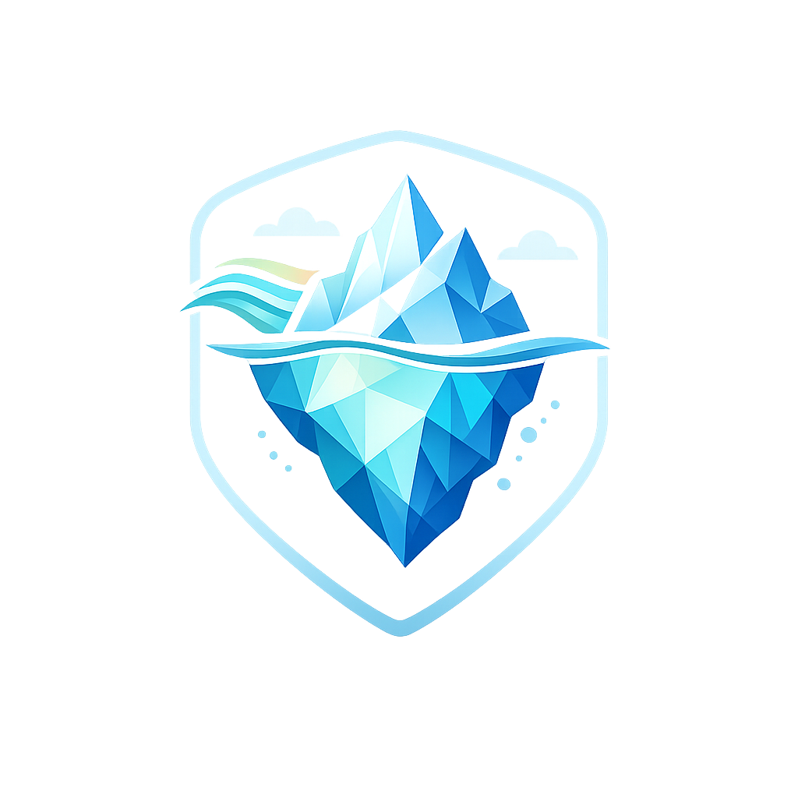
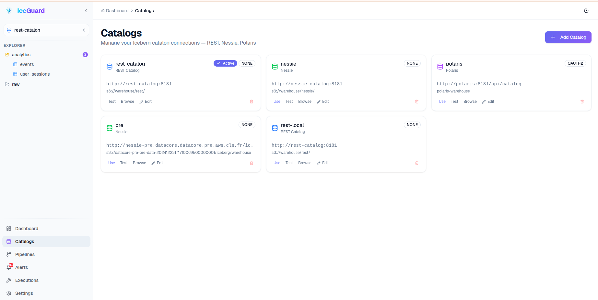
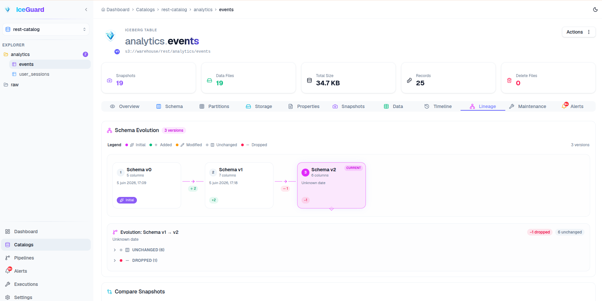
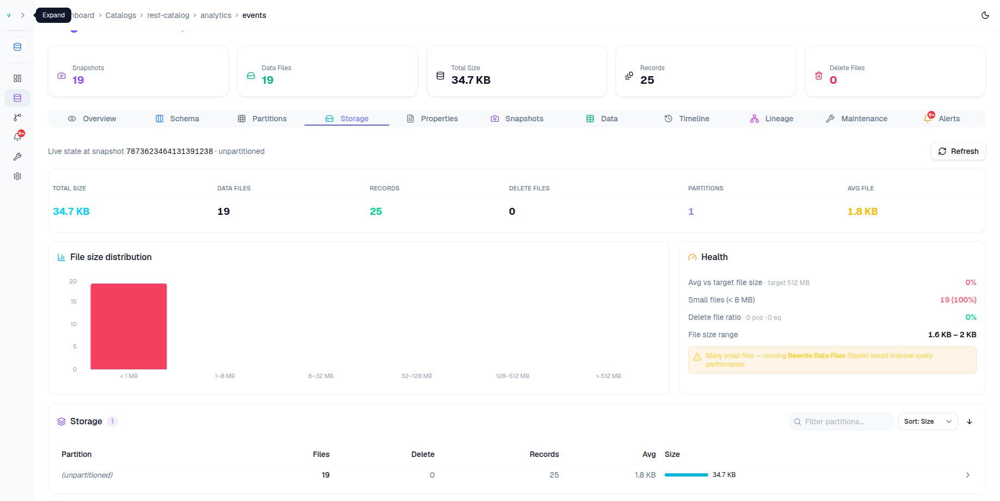
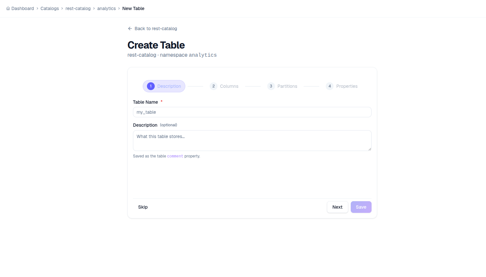
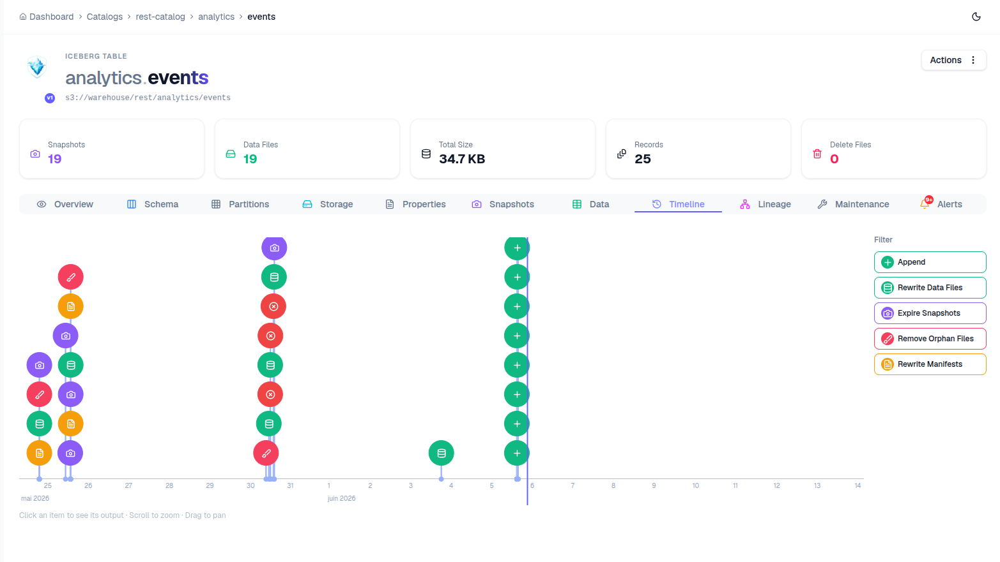
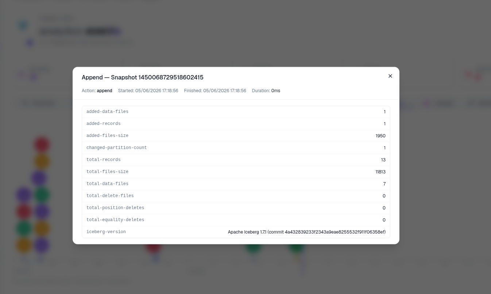
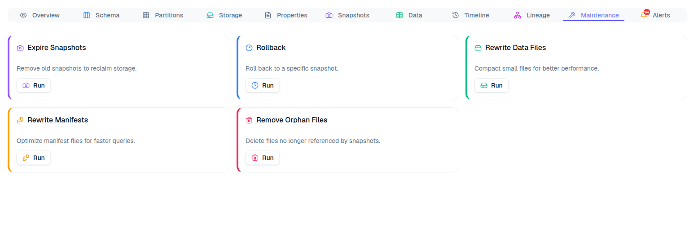
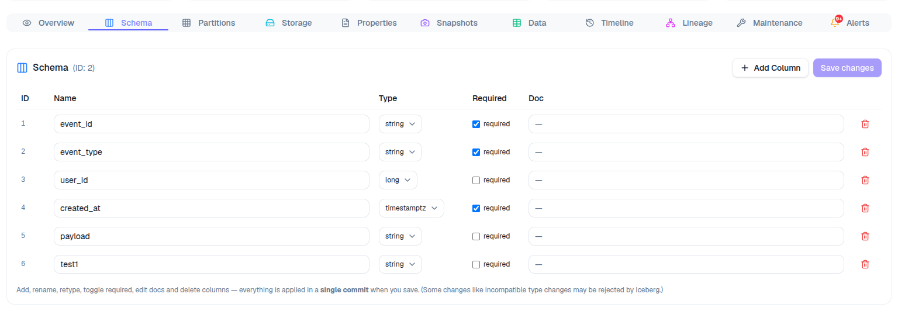
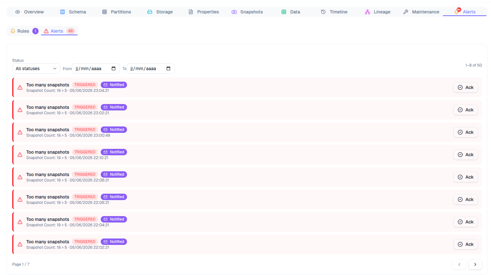

<div align="center">



# IceGuard

**A modern web console to manage, inspect and maintain Apache Iceberg™ tables across multiple catalogs.**

[](LICENSE)
[](backend)
[](frontend)
[](CONTRIBUTING.md)

<br/>


<sub>Browse tagged catalogs → add a catalog with the guided wizard → inspect a table's metadata, snapshots and storage. <a href="docs/demo.mp4">▶ MP4 version</a></sub>

</div>

> ⚠️ **Independent community project — not affiliated with or endorsed by the Apache Software Foundation.**
> "Apache", "Apache Iceberg", "Iceberg" and "Apache Polaris" are trademarks of the ASF.

---

## What is IceGuard?

IceGuard is an admin & maintenance console for the **Apache Iceberg** lakehouse. Point it at one or
more catalogs (REST, Nessie, Polaris) and get a single UI to browse namespaces and tables, evolve
schemas and partitions, edit properties, sample data, inspect storage layout, view lineage, and run
(or schedule) maintenance like snapshot expiration and data-file compaction.

It is **not** a catalog — it sits on top of your existing Iceberg catalogs.

### What IceGuard actually is

IceGuard is **two components**:

1. **Frontend** — the React/TypeScript web UI.
2. **Backend** — the Quarkus REST API.

It has **one required dependency**: a **PostgreSQL** database (you provide it), where the backend
stores IceGuard's own state — registered catalogs, pipelines, schedules, alerts and execution
history. Postgres is not part of IceGuard; it's infrastructure IceGuard needs to run, like a JVM.

IceGuard then **connects to your own** Iceberg catalog(s) and object store.

> The `docker-compose.yml` in this repo (MinIO, an Iceberg REST Catalog, Nessie, Apache Polaris,
> optionally Spark) is **only a local test sandbox** so you can try IceGuard end-to-end without
> bringing your own infrastructure. **It is not part of the product** — in production you point
> IceGuard at your existing catalogs and storage.

## Features

- **Multi-catalog** — register and switch between REST, Nessie and Polaris catalogs (OAuth2/Bearer/Basic supported).
- **Namespaces & tables** — browse the tree, create namespaces, create/drop/rename tables, insert sample rows.
- **Schema editor** — add / rename / retype / re-doc / drop multiple columns, applied in a **single commit**.
- **Properties editor** — add / update / remove table properties in a **single commit**.
- **Partition evolution** — add or drop partition fields (identity, bucket, truncate, year/month/day/hour).
- **Storage tab** — point-in-time storage state: totals, file-size histogram, per-partition aggregates
  (server-side paginated), and file drill-down.
- **Lineage / history** — schema-version history with column diffs, and a visual snapshot-to-snapshot diff.
- **Maintenance** — expire snapshots, rewrite data files, rewrite manifests, remove orphan files, rollback.
  Pluggable executors: a **Java API** executor (analyse) and a **Spark** executor (real `rewrite_data_files`,
  local `local[*]` or a remote Spark cluster).
- **Pipelines** — chain maintenance actions with per-action parameters and a cron schedule (Airflow-style run view).
- **Alerts** — threshold rules on table metrics with optional SMTP email notifications.
- **Timeline** — snapshots + executions on one timeline, click any item for its output/logs.

## Screenshots

<table>
  <tr>
    <td width="50%" valign="top">
      <br/>
      <sub><b>Multi-catalog browser</b> — REST, Nessie and Polaris side by side.</sub>
    </td>
    <td width="50%" valign="top">
      <br/>
      <sub><b>Schema evolution &amp; diff</b> — column changes, noisy groups collapsed.</sub>
    </td>
  </tr>
  <tr>
    <td width="50%" valign="top">
      <br/>
      <sub><b>Storage &amp; health</b> — file-size distribution and compaction hints.</sub>
    </td>
    <td width="50%" valign="top">
      <br/>
      <sub><b>Create-table wizard</b> — description, columns, partitions, properties.</sub>
    </td>
  </tr>
  <tr>
    <td width="50%" valign="top">
      <br/>
      <sub><b>Timeline</b> — snapshots &amp; maintenance on one axis, filterable.</sub>
    </td>
    <td width="50%" valign="top">
      <br/>
      <sub><b>Snapshot detail</b> — the full commit summary.</sub>
    </td>
  </tr>
  <tr>
    <td width="50%" valign="top">
      <br/>
      <sub><b>Maintenance</b> — expire, compact, rewrite, rollback, remove orphans.</sub>
    </td>
    <td width="50%" valign="top">
      <br/>
      <sub><b>Schema editor</b> — multi-column edits applied in a single commit.</sub>
    </td>
  </tr>
  <tr>
    <td width="50%" valign="top">
      <br/>
      <sub><b>Alerts</b> — filterable, paginated events with acknowledge.</sub>
    </td>
    <td width="50%"></td>
  </tr>
</table>

## Stack

| Layer | Tech |
|-------|------|
| Frontend (product) | React, TypeScript, Vite, Tailwind CSS, shadcn/ui, TanStack Query, Zustand, Recharts |
| Backend (product) | Java 21, Quarkus 3.17, RESTEasy Reactive, Hibernate Panache, Flyway, Apache Iceberg 1.7 |
| Required dependency | PostgreSQL (backend state) |
| Test sandbox only | Docker Compose: MinIO (S3), Iceberg REST Catalog, Nessie, Apache Polaris, (optional) Spark |

## Quick start

Requirements: Docker + Docker Compose. (For hot-reload development: JDK 21 & Maven, Node 20+.)

The app is two services — **frontend** + **backend** — plus a required **Postgres**.
`docker-compose.yml` bundles them in three tiers via Compose profiles:

| Level | Command | Services | When |
|------|---------|----------|------|
| 1 — app (official) | `docker compose up -d --build` | frontend + backend | Bring your own Postgres (`ICEGUARD_DB_URL` in `.env`) |
| 2 — + database | `docker compose --profile db up -d --build` | + Postgres | Self-contained app + its required DB |
| 3 — + test sandbox | `docker compose --profile db --profile sandbox up -d --build` | + MinIO + REST catalog | Try everything locally |

For the quickest tour, use **Level 3** and open **http://localhost:8090**, then
**Catalogs → Add Catalog** with URI `http://rest-catalog:8181`.
Tear down with `docker compose --profile db --profile sandbox down` (add `-v` to wipe data).

| Service | URL | Notes |
|---------|-----|-------|
| Frontend (UI) | http://localhost:8090 | nginx; proxies `/api` to the backend |
| Backend API | http://localhost:8080 | Swagger at `/q/swagger-ui` |
| MinIO console | http://localhost:9001 | `minioadmin` / `minioadmin` (sandbox profile) |
| Iceberg REST catalog | http://localhost:8181 | sandbox profile; register it as `http://rest-catalog:8181` |

### Develop (hot reload)

Run the dependencies in Docker and the app from source:

```bash
# deps only (Postgres :5433, REST catalog :8181, MinIO) — not the backend container
docker compose -f docker-compose.dev.yml up -d postgres rest-catalog nessie-catalog minio minio-init
cd backend && mvn quarkus:dev -Dquarkus.profile=docker   # :8080  (Swagger: /q/swagger-ui)
cd frontend && npm install && npm run dev                 # :5173  (proxies /api to :8080)
```

### Advanced: full multi-catalog sandbox

For every catalog type at once (REST **+ Nessie + Polaris**) and real Spark compaction:

```bash
docker compose -f docker-compose.dev.yml up -d
./scripts/seed-catalog.sh        # after the backend is up
```

The **REST Catalog** and **Nessie** demo catalogs work out of the box on MinIO.
**Polaris writes require real AWS S3** — copy `.env.example` to `.env`; see [`CLAUDE.md`](CLAUDE.md).

### Using IceGuard for real

Deploy the **frontend** and **backend**, point the backend at a **PostgreSQL** you provide
(`QUARKUS_DATASOURCE_JDBC_URL` / username / password), then add your own catalog(s) from the UI
(**Catalogs → Add Catalog**): REST / Nessie / Polaris URI, warehouse, auth (OAuth2 / Bearer / Basic)
and, if needed, S3 credentials. No MinIO/Spark/sandbox containers required.

## Architecture

```
        IceGuard (the product)            required dep            your existing systems
   ┌───────────────────────────────┐
   │ React + Vite (UI, :5173)       │
   │           │                    │
   │ Quarkus REST API (:8080) ──────┼──> PostgreSQL ─────────┐
   └───────────────────────────────┘   (IceGuard state)     │
                   │                                         │
                   └──────────────────> Iceberg catalogs (REST / Nessie / Polaris)
                                                  └──> S3 / object store (data & metadata)
```

IceGuard's own state (registered catalogs, pipelines, schedules, alerts, execution history) lives in
the PostgreSQL you provide; table data & metadata live in **your** object store via **your** Iceberg
catalogs.

## Project layout

```
backend/                 Quarkus REST API (com.iceguard.*)
frontend/                React + TypeScript SPA
scripts/                 seed + helper scripts
docker-compose.yml       app stack (frontend + backend; profiles: db / sandbox)
docker-compose.dev.yml   advanced multi-catalog sandbox (Nessie, Polaris, Spark)
CLAUDE.md                detailed architecture notes & known limitations
```

## Known limitations

- The **Java** rewrite-data-files executor is analyse-only; real compaction needs the **Spark** executor.
- **Polaris + MinIO**: browsing works, but writes fail (Polaris ignores the S3-compatible endpoint) — use real AWS S3.
- Catalog credentials are stored in PostgreSQL (not encrypted at rest) — treat the DB as sensitive.
- Test coverage is early-stage. Contributions very welcome 🙂

## Contributing

Contributions, issues and ideas are welcome! Please read **[CONTRIBUTING.md](CONTRIBUTING.md)** and our
**[Code of Conduct](CODE_OF_CONDUCT.md)**. Good first issues are labelled `good first issue`.

## License

[Apache License 2.0](LICENSE).
